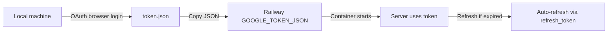

# Deployment Plan: Google MCP Server on Railway

This document describes how to deploy `google-mcp-server` to [Railway](https://railway.app). It covers prerequisites, required code adaptations, Railway configuration, secrets management, and verification.

---

## 1. Overview

| Item | Local (current) | Railway (target) |
|------|-----------------|------------------|
| Process | `python server.py` on `127.0.0.1:8000` | `uvicorn` on `0.0.0.0:$PORT` |
| OAuth login | Browser via `run_local_server()` | Pre-generated token injected as a secret |
| Credentials | `credentials.json` file | `GOOGLE_CREDENTIALS_JSON` env var |
| Token | `token.json` file | `GOOGLE_TOKEN_JSON` env var (+ optional volume) |
| Approval gate | Terminal `Approve? (y/n)` | **Not available** — replace with API auth |

Railway runs a stateless container with no interactive stdin. The current approval prompt and desktop OAuth flow **will not work** in production without the changes below.

---

## 2. Pre-deployment checklist

### 2.1 Google Cloud (already done locally)

- [ ] Google Docs API enabled
- [ ] Gmail API enabled
- [ ] OAuth consent screen configured (test users added if app is in *Testing*)
- [ ] OAuth client credentials downloaded (`credentials.json`)
- [ ] Valid `token.json` generated locally (you already have this)

### 2.2 Code changes required before deploy

Complete these before pushing to Railway.

#### A. Bind to Railway’s port and host

Railway injects `PORT`. The server must listen on `0.0.0.0`, not `127.0.0.1`.

**Recommended start command (no code change needed if you use this):**

```bash
uvicorn server:app --host 0.0.0.0 --port ${PORT:-8000}
```

#### B. Load secrets from environment variables

Update `auth.py` to support env-based config (keep file-based fallback for local dev):

| Variable | Contents |
|----------|----------|
| `GOOGLE_CREDENTIALS_JSON` | Full JSON from `credentials.json` (single line) |
| `GOOGLE_TOKEN_JSON` | Full JSON from `token.json` (single line) |

On startup, if env vars are set, write them to `/tmp/credentials.json` and `/tmp/token.json`, or parse them in memory with `Credentials.from_authorized_user_info()`.

#### C. Replace interactive approval

The terminal prompt in `require_approval()` blocks forever (or fails) on Railway.

**Options (pick one):**

1. **API key header (recommended for MVP)**  
   - Set `API_KEY` in Railway variables.  
   - Require `X-API-Key: <value>` on every POST request.  
   - Skip approval when `API_KEY` is set and header matches.

2. **Disable approval in production**  
   - Gate with `if os.getenv("RAILWAY_ENVIRONMENT"): return`  
   - Only safe if the service URL is not public (Railway private networking) or you add another auth layer.

3. **Async approval (future)**  
   - Queue actions and approve via Slack/email — out of scope for initial deploy.

#### D. Token refresh persistence (optional but recommended)

When Google refreshes the access token, the current code writes to `token.json`. On Railway, the filesystem is ephemeral unless you attach a **Volume**.

- **Simple:** Inject `GOOGLE_TOKEN_JSON`; accept that refresh updates are lost until you re-upload the token (refresh tokens usually last a long time).
- **Better:** Mount a Railway Volume at `/data` and set `TOKEN_FILE=/data/token.json`.

---

## 3. Railway project setup

### 3.1 Create the service

1. Log in to [railway.app](https://railway.app).
2. **New Project** → **Deploy from GitHub repo** (or **Empty Project** + CLI).
3. If the repo root is `MCP-Server/`, set **Root Directory** to `google-mcp-server`.
4. Railway auto-detects Python via Nixpacks from `requirements.txt`.

### 3.2 Add deployment files (recommended)

Create these in `google-mcp-server/`:

**`Procfile`**

```
web: uvicorn server:app --host 0.0.0.0 --port $PORT
```

**`railway.toml`** (optional)

```toml
[build]
builder = "NIXPACKS"

[deploy]
startCommand = "uvicorn server:app --host 0.0.0.0 --port $PORT"
healthcheckPath = "/health"
healthcheckTimeout = 30
restartPolicyType = "ON_FAILURE"
```

**`.python-version`** (optional, for consistent runtime)

```
3.12
```

### 3.3 Environment variables

In Railway → your service → **Variables**, add:

| Name | Value | Notes |
|------|-------|-------|
| `GOOGLE_CREDENTIALS_JSON` | `{"installed":{...}}` | Paste entire `credentials.json` as one line |
| `GOOGLE_TOKEN_JSON` | `{"token":...}` | Paste entire `token.json` as one line |
| `API_KEY` | *(generate a long random string)* | Protect POST endpoints |
| `PORT` | *(auto-set by Railway)* | Do not override manually |

**Generate secrets locally (PowerShell):**

```powershell
# API key
[Convert]::ToBase64String((1..32 | ForEach-Object { Get-Random -Maximum 256 }))

# Copy JSON as single line for Railway
Get-Content token.json -Raw
Get-Content credentials.json -Raw
```

Mark `GOOGLE_CREDENTIALS_JSON`, `GOOGLE_TOKEN_JSON`, and `API_KEY` as **secrets** in Railway.

### 3.4 Networking

1. Railway → service → **Settings** → **Networking** → **Generate Domain**.
2. Note the public URL, e.g. `https://google-mcp-server-production.up.railway.app`.
3. Treat this URL as sensitive if endpoints are not fully authenticated.

---

## 4. OAuth bootstrap workflow

OAuth browser login **cannot** run inside Railway. Use this one-time local → cloud flow:



**Steps:**

1. Run locally: `python -c "from auth import get_credentials; get_credentials()"`
2. Confirm `token.json` contains `"refresh_token"`.
3. Copy the full file contents into Railway variable `GOOGLE_TOKEN_JSON`.
4. Redeploy.

If you ever see `invalid_grant`, repeat the local OAuth flow and update the Railway secret.

---

## 5. Deploy

### Option A: GitHub (recommended)

```bash
git add google-mcp-server/
git commit -m "Add Railway deployment config"
git push origin main
```

Railway redeploys automatically on push.

### Option B: Railway CLI

```bash
npm i -g @railway/cli
railway login
cd google-mcp-server
railway init
railway up
```

---

## 6. Post-deploy verification

### Health check

```bash
curl https://YOUR-RAILWAY-DOMAIN.up.railway.app/health
```

Expected:

```json
{"status":"ok"}
```

### Create email draft

```bash
curl -X POST https://YOUR-RAILWAY-DOMAIN.up.railway.app/create_email_draft \
  -H "Content-Type: application/json" \
  -H "X-API-Key: YOUR_API_KEY" \
  -d '{"to":"you@example.com","subject":"Railway test","body":"Deployed successfully."}'
```

### Append to Google Doc

```bash
curl -X POST https://YOUR-RAILWAY-DOMAIN.up.railway.app/append_to_doc \
  -H "Content-Type: application/json" \
  -H "X-API-Key: YOUR_API_KEY" \
  -d '{"doc_id":"YOUR_DOC_ID","content":"Line from Railway.\n"}'
```

Check Railway **Deploy Logs** for errors (auth, missing env vars, Google API 403).

---

## 7. Security hardening

| Risk | Mitigation |
|------|------------|
| Public URL exposes Google actions | Require `X-API-Key` on all mutating routes |
| Secrets in git | Never commit `credentials.json` / `token.json`; use Railway variables only |
| Token leakage in logs | Do not log env vars or token contents |
| OAuth app in Testing mode | Only listed test users can authorize; publish app for broader use |
| Rate abuse | Add Railway rate limits or a reverse proxy (Cloudflare) in front |

Optional: restrict Google Cloud OAuth client to your Railway domain if you switch from Desktop to Web application credentials.

---

## 8. Monitoring and operations

- **Logs:** Railway dashboard → Deployments → View logs (`print()` output appears here).
- **Restarts:** Railway restarts on crash; use `/health` for health checks.
- **Updates:** Push to GitHub or `railway up`; env vars persist across deploys.
- **Token rotation:** Update `GOOGLE_TOKEN_JSON` in Railway when re-authenticating locally.
- **Costs:** Hobby plan includes usage limits; this service is lightweight (HTTP + Google API calls).

---

## 9. Troubleshooting

| Symptom | Likely cause | Fix |
|---------|--------------|-----|
| Build fails | Wrong root directory | Set Railway root to `google-mcp-server` |
| `Application failed to respond` | Bound to `127.0.0.1` | Use `--host 0.0.0.0 --port $PORT` |
| Hangs on POST | `input("Approve?")` waiting for stdin | Disable or replace approval in production |
| `Missing credentials.json` | Env var not loaded | Set `GOOGLE_CREDENTIALS_JSON`; update `auth.py` |
| `invalid_grant` | Revoked or expired refresh token | Re-run local OAuth; update `GOOGLE_TOKEN_JSON` |
| Google API 403 | APIs disabled or wrong account | Enable APIs; ensure token account owns the Doc / Gmail |
| 502 from server | Google API error | Check Railway logs for full exception |

---

## 10. Implementation order (summary)

1. Update `auth.py` — read credentials/token from env vars.
2. Update `server.py` — API key auth instead of terminal approval in production; optional `PORT`/`HOST` handling.
3. Add `Procfile` and optional `railway.toml`.
4. Push repo; connect Railway with root directory `google-mcp-server`.
5. Set `GOOGLE_CREDENTIALS_JSON`, `GOOGLE_TOKEN_JSON`, and `API_KEY` in Railway.
6. Generate public domain; run health + smoke tests.
7. (Optional) Attach Volume for persistent `token.json` after refresh.

---

## 11. Connecting Cursor / MCP clients

This project is a **REST API**, not a stdio MCP server. To use it from Cursor or other tools:

- Point HTTP clients at your Railway URL.
- Pass `X-API-Key` on each request.
- Or wrap these endpoints in a thin MCP adapter (separate future task).

Example base URL for tools:

```
https://YOUR-RAILWAY-DOMAIN.up.railway.app
```

Endpoints:

- `POST /append_to_doc`
- `POST /create_email_draft`
- `GET /health`

---

## 12. Rollback

Railway keeps deployment history. To rollback:

1. Open the service in Railway.
2. **Deployments** → select a previous successful deploy → **Redeploy**.

Env variables are unchanged during rollback.
